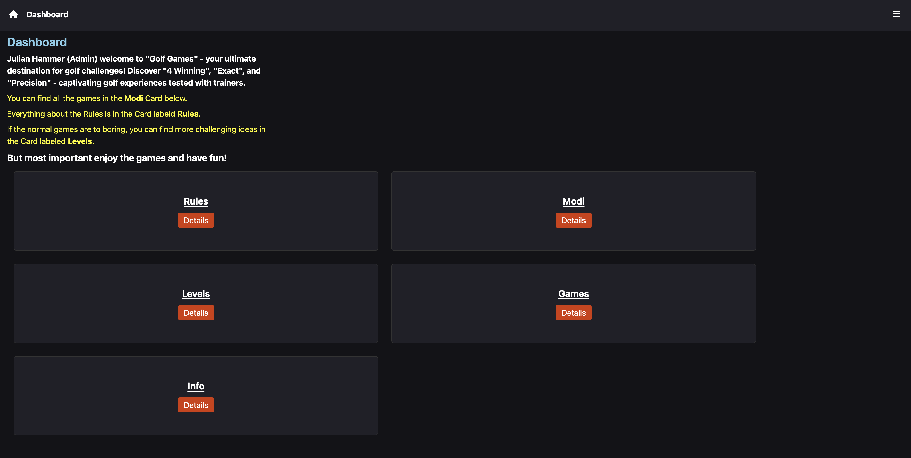
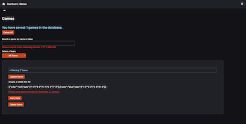

# Golf Games

  

## Sites

[Golf Games](https://golf.moinjulian.com)

## Dashboard

## Games Tab

## What is Golf Games

Golf Games are all my games I've developed in the context of golf, the first version was
made with JavaScript, the second and currently used version was made with [SvelteKit](https://kit.svelte.dev),
which is a JavaScript Framework and the full stack Verison of [Svelte](https://svelte.dev).

## Further Informations

[FAQ](./readme/FAQ.md)  
[Why did I decide to develop Golf Games](./readme/why-did-I-decide-to-develop-golf-games.md)  
[Credits](./readme/Credits.md)  
[What is Golf Games About?](./readme/What-is-Golf-Games-about.md)

## Copyright

Copyright 2023 Julian Hammer

License  
[All rights reserved](/LICENSE.md)
