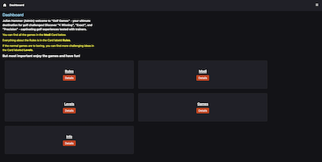

# Real Golf

## Licensing

The Games are Licensend under the [All Rights Reserved](/LICENSE.md) License.

The Documentations and Golf Rules are open source and Licensend under the [MIT](/documentation/LICENSE.md) License.

## Documentation

The Documentation and any other Information about this Project can be found here:
[Real Golf Documentation](https://docs.realgolf.games)

## Games

The Games can be found on the domain below:

[Real Golf](https://realgolf.games)

## Milestones

### Commit Milestone

You can see the Commit Milestone [here](./Commit_Milestones.md).

## Screenshots

## What is Real Golf

Real Golf are all my games I've developed in the context of golf, the first version was
made with JavaScript, the second and currently used version was made with [SvelteKit](https://kit.svelte.dev),
which is a JavaScript Framework and the full stack Verison of [Svelte](https://svelte.dev).

## Contributing Guidelines

If you want to contribute to this project, please follow the guidelines outlined in [CONTRIBUTING.md](CONTRIBUTING.md).

## Further Informations

[FAQ](./readme/src/FAQ.md)  
[Why did I decide to develop Real Golf](./readme/src/why-did-I-decide-to-develop-golf-games.md)  
[Credits](./readme/src/Credits.md)  
[What is Real Golf About?](./readme/src/What-is-Golf-Games-about.md)

## Copyright

Copyright 2023 Julian Hammer

License  
[All rights reserved](/LICENSE.md)
